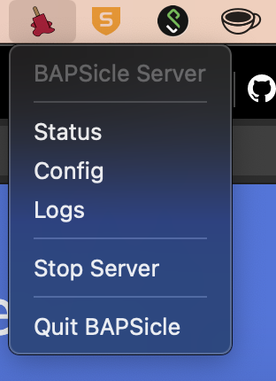

# BAPSicle
### a.k.a. The Next-Gen BAPS server

Welcome! This is BAPS. More acurately, this is yet another attempt at a BAPS3 server.

## Installing

Just want to install BAPSicle?

### Windows

Currently there's just a batch script. Simply run ``install.bat`` as administrator. If you've just built BAPSicle yourself, it'll be in the ``/install`` folder.

This will:
* Copy BAPSicle into ``C:\Program Files\BAPSicle``
* Install BAPSicle.exe as a Windows Service with NSSM.
* If all goes well, open [http://localhost:13500](localhost:13500) for the server UI.

### Linux

Installed service for linux is coming soon. Testing is primarily on Ubuntu 20.04. Your milage with other distros will vary.

### MacOS

Currently there's no installer for MacOS, so you'll have to move the ``build/output/BAPSicle.app`` you've built and make it start automatically (if you want).

Starting and stopping the server, as well as UI links, are available in the System Menu once opening the app.

## Developing

### Requirements

On all platforms:
* Python 3.7 - 3.9 Tested (macOS 3.7 may be iffy)
* Git (Obviously)

On MacOS:
* Homebrew (To install command line Platypus)

### Running
To just run the server standaline without installing, run ``python ./launch_standalone.py``.

## Building

### Windows

To build a ``BAPSicle.exe``, run ``build\build-exe.bat``. The resulting file will appear in ``build\output``. You can then use the install instructions above to install it, or just run it standalone.

### Linux

To build a ``BAPSicle`` executable, run ``build/build-linux.sh``. The resulting file will appear in ``build/output``.

### MacOS

To build a ``BAPSicle.app``, run ``build/build-macos.sh``. The resulting file will appear in ``build/output``.

### Other bits

Provided is a VScode debug config to let you debug live, as well as ``dev\install-githook.{bat,sh}`` that will help git to clean your code up as you're committing!
